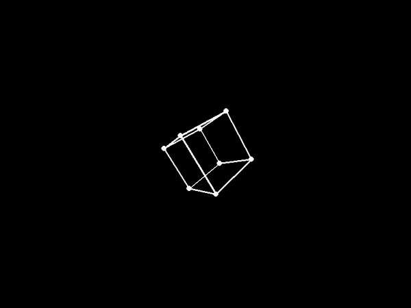
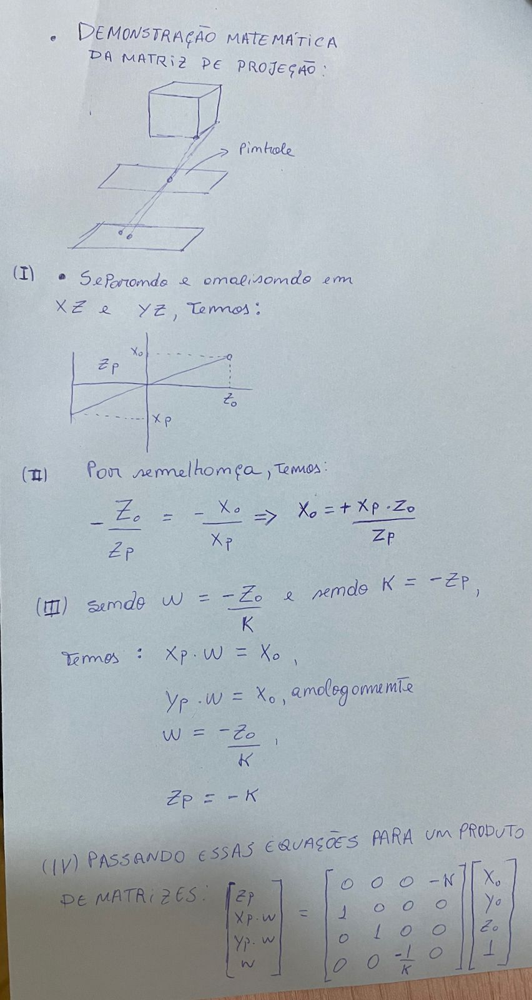

# 3D cube projection project
## projeção de cubo 

### Introdução  
Este programa utiliza a biblioteca pygame e numpy para realizar uma rotação de cubo tridimensional e projetar para a tela.

### Equações implementadas  
Matrizes e equações em seu funcionamento:

Matriz de rotação:  
São utilizadas matrizes de rotação com 4 dimensões, para garantir a possibilidade de rotacionar o cubo nas 3 dimensões e a última dimensão permite translações, tópico da próxima seção. Como o cubo é criado na origem dos espaços (0,0,0), as operações de rotação foram aplicadas diretamente. Segue abaixo as matrizes usadas:

$$
R_x = \begin{bmatrix}
1 & 0 & 0 & 0 \\
0 & \cos(\theta) & -\sin(\theta) & 0 \\
0 & \sin(\theta) & \cos(\theta) & 0 \\
0 & 0 & 0 & 1
\end{bmatrix}
\hspace{0.5in}
R_y = \begin{bmatrix}
\cos(\theta) & 0 & \sin(\theta) & 0 \\
0 & 1 & 0 & 0 \\
-\sin(\theta) & 0 & \cos(\theta) & 0 \\
0 & 0 & 0 & 1
\end{bmatrix}
\hspace{0.5in}
R_z = \begin{bmatrix}
\cos(\theta) & - \sin(\theta) & 0 & 0 \\
\sin(\theta) & \cos(\theta) & 0 & 0 \\
0 & 0 & 1 & 0 \\
0 & 0 & 0 & 1
\end{bmatrix}
$$

Matriz de translação:  
A matriz de translação permite movimentar o cubo no espaço, além de possibilitar o afastamento dele o suficiente para que esteja na frente da câmera.

$$
T = \begin{bmatrix}
1 & 0 & 0 & dx \\
0 & 1 & 0 & dy \\
0 & 0 & 1 & dz \\
0 & 0 & 0 & 1
\end{bmatrix}  
\hspace{0.5in}
$$

Matriz de projeção (3D para 2D):  
Para realizar a projeção das coordenadas em 3D do cubo, foi utilizada uma matriz de projeção P apresentada abaixo: 

$$
P = \begin{bmatrix}
z_p\\
x_p w_p\\
y_p w_p\\
w_p
\end{bmatrix}  
= \begin{bmatrix}
0 & 0 & 0 & -d \\
1 & 0 & 0 & 0 \\
0 & 1 & 0 & 0 \\
0 & 0 & -1/d & 0
\end{bmatrix}  
\hspace{0.5in}
$$

Com Isso, é determinar o $x_p$ e $y_p$, dividindo a segunda e terceira linha da matriz por $w_p$, que é o quarto elemento da matriz.O $d$ é a distância focal, que é a distância entre o anteparo e a câmera. A manipulação utilizada para chegar nessa matriz é a seguinte:  

Como funciona:  
O procedimento para projetar a imagem do cubo rotacionando foi:
1. Criar o cubo.  
No código foi criado um de aresta 2 e multiplicado por 40 para se tornar um cubo de aresta 80, centrado na origem.
  
2. Aplicada as rotações.  
Com o cubo na origem é possível aplicar as rotações a partir da multiplicação matricial das coordenadas do cubo por cada uma das matrizes de rotação apresentada. A ordem não importa, desde que os pontos do cubo estejam mais a direita na multiplicação, ou seja:  
Em que M é a matriz rotacionada e C a matriz com os pontos do cubo.
  
3. Aplicação da translação.  
Em seguida, aplica-se uma translação em z, para garantir que o cubo esteja a uma distância suficiente que permita ser visualizado todos os seus vértices e arestas. Contudo, é possível realizar movimentos no mapa que permitirão que o cubo fique mais próximo ou mais distante da câmera.

4. Translação WASD para movimentar-se no mapa.  
Após a translação que define a posição inicial do cubo frente ao "jogador", é realizada uma nova translação, relativa ao movimento que o personagem realiza no mapa, que é atualizada a cada laço do programa. Essa translação ocorre em x e y, tendo em vista que são os únicos eixos em que o "jogador" pode se movimentar.

5. Rotação do campo de visão da câmera.  
Uma nova rotação é realizada para que o campo de visão seja alterado conforme o jogador move o mouse. Uma função no código permite a captura do vetor que representa a posição antiga e nova do mouse, formando em seguida um vetor deslocamento, usado para incrementar o ângulo de rotação em x e em y. É importante salientar que, esses últimos passos se referem a ações do jogador, mas na prática, elas são realizadas no cubo. Ou seja, o "jogador não roda, o mundo roda em torno dele" (alto estima não falta). 
  
5. Projeção dos pontos no anteparo.  
Nesse passo, é utilizada a matriz de projeção para multiplicar cada um dos pontos do cubo. A projeção é realizada num anteparo, que representa um plano em z = -k, em que k é a distância focal.
  
6. Apresentar na tela e adicionar interatividade.  
Por fim, os pontos são apresentados com uma pequena translação, para que a origem passe a ser o centro da tela (uma particularidade da implementação com o pygame). Além disso, foram adicionadas teclas que permitem alterar parâmetros da simulação, de forma dinâmica, adicionando interatividade. 

### Como usar?
Para rodar o programa, execute o arquivo main.py. As teclas abaixo podem ser usadas para realizar as seguintes ações:

ESC: encerra o programa.  
a: translada o cubo para a direita (como se o "jogador" se movimentasse para esquerda).   
d: translada o cubo para a esquerda.  
w: decrementa a distância do cubo.  
s: incrementa a distância do cubo.  
e: incrmenta a velocidade de rotação do cubo.
q: decrementa a velocidade de rotação do cubo.
scroll: altera a distância focal.
movimento do mouse: altera o campo de visão da câmera.

### Como instalar?  
Para garantir o funcionamento da aplicação é recomedado a criação de um ambiente virtual (venv) para instalar as dependência, como apresentado em https://docs.python.org/3/library/venv.html. Após a criação do ambiente, realizar a instalação das bibliotecas numpy e pygame, com os seguintes comandos do terminal:  
pip install numpy  
pip install pygame

Protinho agora é só rodar o arquivo, através do comando python/python3 main.py ou sua IDE python de preferência.
